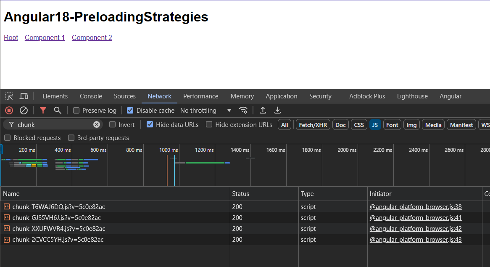
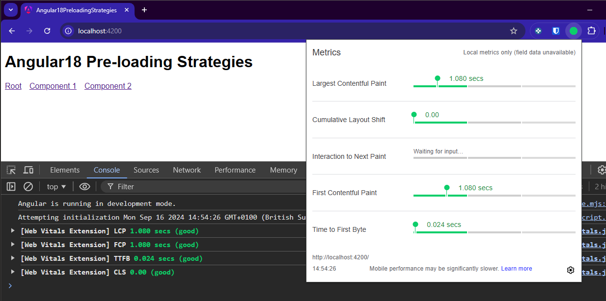
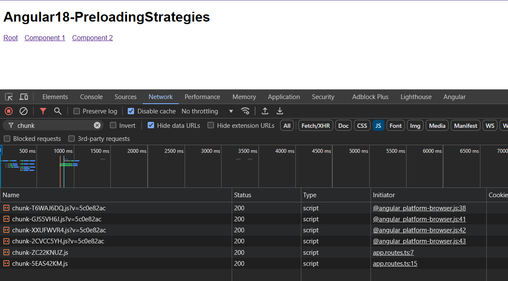
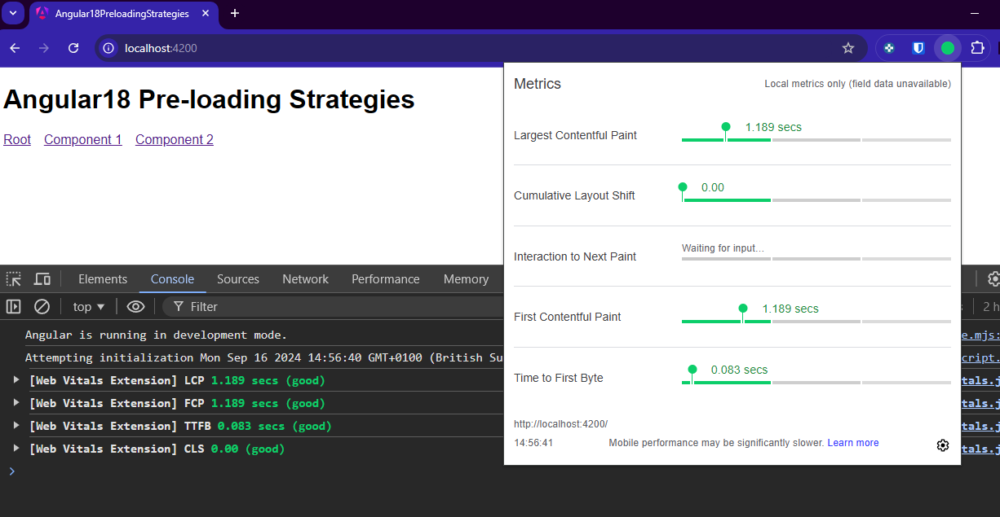
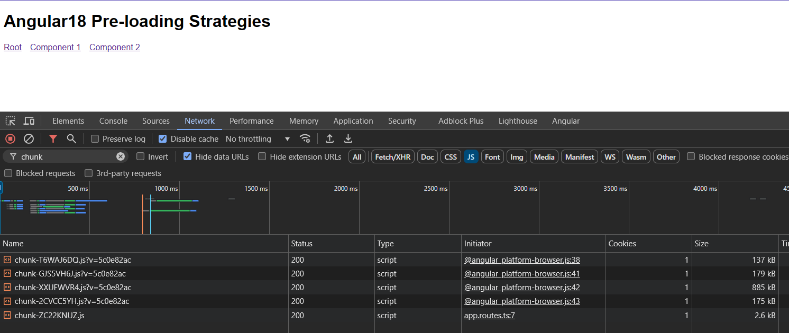
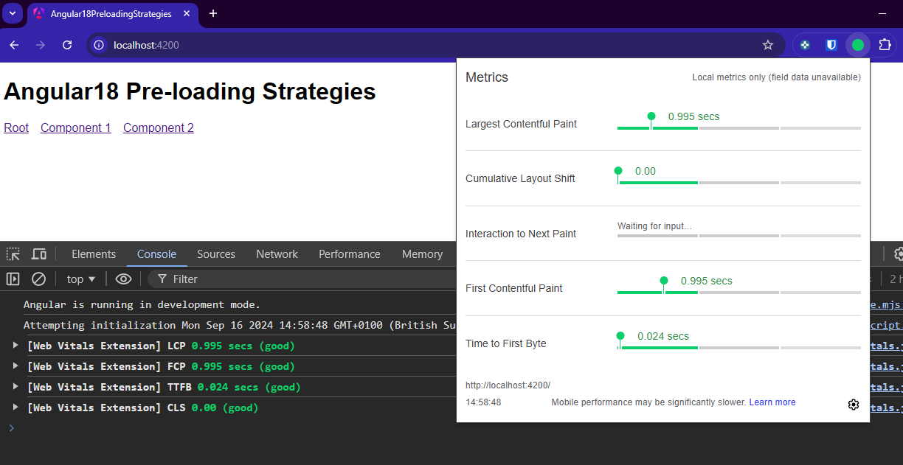

# Angular18 PreloadingStrategies

> This article is about optimising the UX of Angular applications by using preloading strategies to load modules and components in the background.

Preloading strategies are a way to improve the performance of Angular applications by loading modules and components in the background, so that they are ready to be displayed when the user navigates to them. This can significantly reduce the amount of time it takes for a component to be displayed, especially on slower devices or networks.

## Preloading strategies

### No preloading

This strategy does not load any modules or components in the background. When the user navigates to a new component, it is loaded on demand.
This is the default preloading strategy.






---

### Preloading all modules

This strategy loads all modules in the background when the application is first loaded. This ensures that all components are ready to be displayed when the user navigates to them.

```js
// app.config
export const appConfig: ApplicationConfig = {
  providers: [
    ...
    provideRouter(routes, withPreloading(PreloadAllModules)),
  ]
};
```






---

### Selective preloading (custom)

This strategy allows you to selectively preload modules and components based on certain criteria, such as the size of the module or the likelihood that the user will navigate to it.

```js
export const appConfig: ApplicationConfig = {
  providers: [
    provideRouter(routes, withPreloading(FlagPreloadingStrategyService)),
  ]
};
```





---

## Conclusion

Regardless of which preloading strategy you use, the Angular CLI will generate separate chunks for each lazy-loaded module and component. This allows the application to be loaded and executed efficiently, even on slower devices or networks.

---

This project was generated with [Angular CLI](https://github.com/angular/angular-cli) version 18.0.3.

## Development server

Run `ng serve` for a dev server. Navigate to `http://localhost:4200/`. The application will automatically reload if you change any of the source files.

## Code scaffolding

Run `ng generate component component-name` to generate a new component. You can also use `ng generate directive|pipe|service|class|guard|interface|enum|module`.

## Build

Run `ng build` to build the project. The build artifacts will be stored in the `dist/` directory.

## Running unit tests

Run `ng test` to execute the unit tests via [Karma](https://karma-runner.github.io).

## Running end-to-end tests

Run `ng e2e` to execute the end-to-end tests via a platform of your choice. To use this command, you need to first add a package that implements end-to-end testing capabilities.

## Further help

To get more help on the Angular CLI use `ng help` or go check out the [Angular CLI Overview and Command Reference](https://angular.dev/tools/cli) page.

---

### :100: <i>Thanks!</i>
#### Now, don't be an stranger. Let's stay in touch!

<a href="https://github.com/leolanese" target="_blank" rel="noopener noreferrer">
  
</a>

##### :radio_button: Linkedin: <a href="https://www.linkedin.com/in/leolanese/" target="_blank">LeoLanese</a>
##### :radio_button: Twitter: <a href="https://twitter.com/LeoLanese" target="_blank">@LeoLanese</a>
##### :radio_button: Portfolio: <a href="https://www.leolanese.com" target="_blank">www.leolanese.com</a>
##### :radio_button: DEV.to: <a href="https://www.dev.to/leolanese" target="_blank">dev.to/leolanese</a>
##### :radio_button: Blog: <a href="https://www.leolanese.com/blog" target="_blank">leolanese.com/blog</a>
##### :radio_button: Questions / Suggestion / Recommendation: developer@leolanese.com
